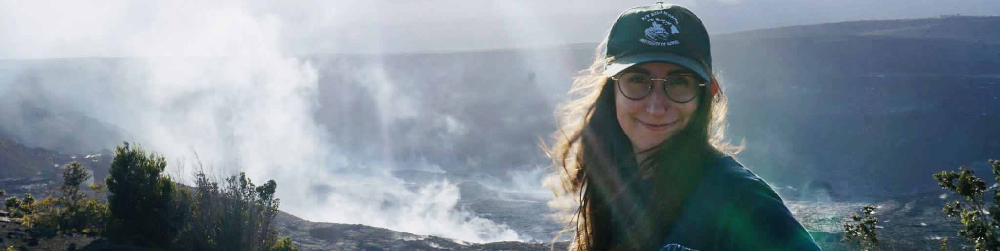

 

 

<h3>
About
</h3>
&nbsp;&nbsp;&nbsp;&nbsp;I am  PhD student working with Dr. Kolawole in the 
[Crustal Deformation Group](https://www.folarinkolawole.com) at [Lamont-Doherty Earth Observatory](https://lamont.columbia.edu). 
My research focuses on integrating field structural geology, seismology and numerical modeling to understand how 
continental rift segments propagate in space and time, and the mechanics of rift interaction and linkage.

&nbsp;&nbsp;&nbsp;&nbsp;My previous work at the Infrasound Lab (ISLA) at the 
[University of Hawaiʻi](https://www.hawaii.edu/) involved building algorithms for geoscience research, such as examining 
signals from the 
[IMS Infrasound Network](https://www.ctbto.org/our-work/monitoring-technologies/infrasound-monitoring), or more 
recently, wrangling the data of the 
[2022 Tonga eruption](https://en.wikipedia.org/wiki/2022_Hunga_Tonga%E2%80%93Hunga_Ha%27apai_eruption_and_tsunami).

&nbsp;&nbsp;&nbsp;&nbsp;I earned a B.A. in Physics from Carleton College. During my undergraduate years I participated in 
physics research opportunities, such as exploring the [complex dynamics of a laser](https://www.nature.com/articles/s41598-018-29110-5), 
and geology research, such 
as analyzing [seismic data from the 2018 Kīlauea eruption](https://ui.adsabs.harvard.edu/abs/2019AGUFM.V43C0202C/abstract). 

 

<h3>
Other things
</h3>

- The base for this website is [researcher](https://github.com/ankitsultana/researcher), by Ankit Sultana, and heavily influenced
by [Maria Antoniak](https://maria-antoniak.github.io), all credit to her!

- My favorite webpage is [Earth](https://earth.nullschool.net), a project to visualize global weather conditions (and it's
[open-source](https://github.com/cambecc/earth)!). My favorite Wikipedia page is
[Timeline of the far future](https://en.wikipedia.org/wiki/Timeline_of_the_far_future).

 

