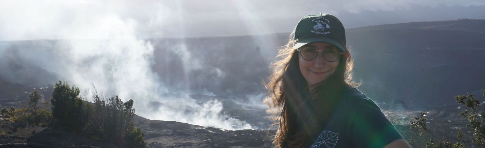

<h3>
About
</h3>

I am a Field System Engineer and Analyst at the Infrasound Lab (ISLA) at the 
[University of Hawaiʻi (UH)](https://www.hawaii.edu/). At UH, I am affiliated with the 
[Hawaiʻi Institute of Geophysics and Planetology](https://www.higp.hawaii.edu/) and the 
[School of Ocean and Earth Science and Technology](https://www.soest.hawaii.edu/soestwp/).

At ISLA, I build algorithms for geoscience research, such as signals from the 
[IMS Infrasound Network](https://www.ctbto.org/our-work/monitoring-technologies/infrasound-monitoring), or more 
recently, wrangling the data of the 
[2022 Tonga eruption](https://en.wikipedia.org/wiki/2022_Hunga_Tonga%E2%80%93Hunga_Ha%27apai_eruption_and_tsunami).

I earned a B.A. in Physics from Carleton College. During my undergraduate years I participated in research opportunities 
in physics, such as [complex dynamics of a laser](https://www.nature.com/articles/s41598-018-29110-5), and in geology, such 
as [seismic data from the 2018 Kīlauea eruption](https://ui.adsabs.harvard.edu/abs/2019AGUFM.V43C0202C/abstract). 

<h3>
Other things
</h3>

- The base for my [website template](https://github.com/ankitsultana/researcher), by Ankit Sultana.

