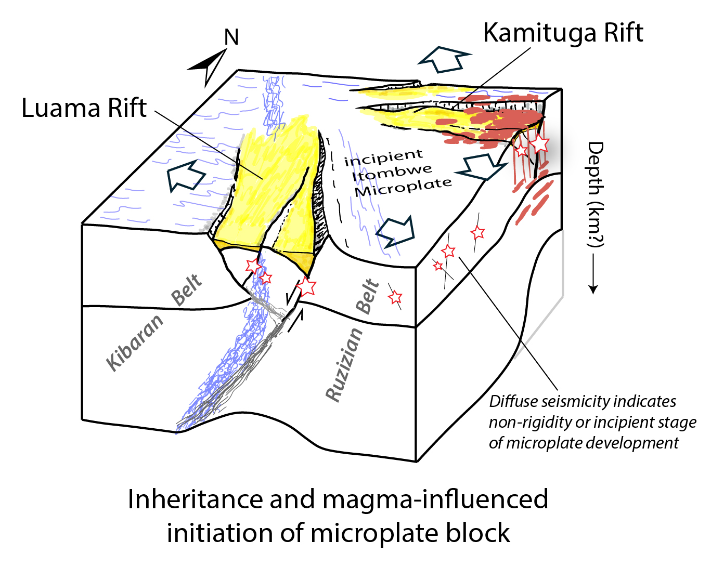

 

 

<h3>Welcome!</h3>

&nbsp;&nbsp;&nbsp;&nbsp;I am a Ph.D. Candidate working with Dr. Folarin Kolawole in the 
[Crustal Deformation Group](https://www.folarinkolawole.com) at [Columbia University](https://eesc.columbia.edu). 

&nbsp;&nbsp;&nbsp;&nbsp;My research focuses on integrating field structural geology and seismology to understand multi-scale crustal structure and modes of strain release along evolving active divergent plate boundaries. My current research areas include the East African Rift System (Tanzania and Congo) and the Axial submarine volcano (offshore Oregon, US).

&nbsp;&nbsp;&nbsp;&nbsp;I earned a B.A. in Physics from Carleton College. During my undergraduate years, I participated in 
physics research opportunities, such as exploring the [complex dynamics of a laser](https://www.nature.com/articles/s41598-018-29110-5), 
and geology research, such as analyzing [seismic data from the 2018 Kīlauea eruption](https://ui.adsabs.harvard.edu/abs/2019AGUFM.V43C0202C/abstract). After graduating, I worked at the Infrasound Lab (ISLA) at the 
[University of Hawaiʻi](https://www.higp.hawaii.edu) where I developed algorithms for geoscience research, such as examining signals from the IMS Infrasound Network, before beginning graduate school at Columbia.

 

<b>Email:</b> mcolet@ldeo.columbia.edu `|` <b>[Google Scholar](https://scholar.google.com/citations?user=Avl1FTkAAAAJ&hl=en&oi=ao)</b> 

 

<h3>Upcoming Events</h3>

- Oct. 2025: <b>GSA annual conference</b>, San Antonio, TX 
- Dec. 2025: <b>AGU annual conference</b>, New Orleans, LA 

 

<h3>Recent Publication</h3>

 

 

<h4> <b> Active Crustal Deformation across a Nucleating Extensional Microplate, D. R. Congo, East Africa </b> </h4>

&nbsp;Colet, M., Kolawole, F., Ajala, R., Delvaux, D., & Nkodia, H. M. D-V. 

<i><a href="https://agupubs.onlinelibrary.wiley.com/doi/10.1029/2025TC008815?af=R">Published in Tectonics (July 2025)</a></i>

 

 

 

